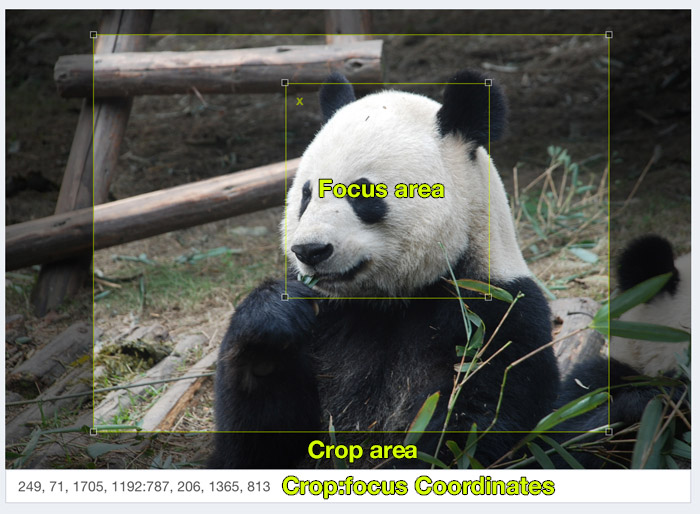
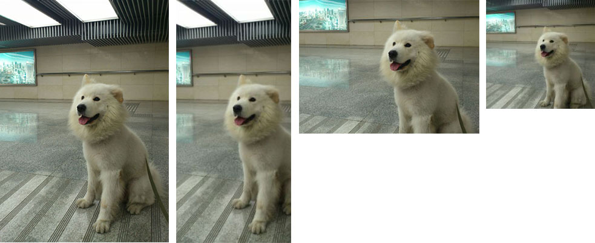

# Art Direction

Styled images are automatically cropped which can cause important parts of the image to be cut out or partially cut out.
This where art direction can help. 

By defining which area of a source image is the focus area, or the most important,area of the image, we can ensure that 
this area is always include in any cropped images. 

## CropFocus Widget

This bundle includes a widget for defining two areas on the source image.



### The crop Area
The crop area is an area of the image that is always removed.

### The focus area
The focus area is an area which is never cropped out. This area is the most important part of the image  

### Usage
The CropFocus widget is included in the generated crud. A custom formType is included which creates a 'crop and focus widget'. This widget allows users to select an area which is always cropped out of the image, and a focus area which is always included in the image.


The black area will always be cropped out for all image styles. The inner rectangle will always be fully included in styled images. 
There are some combinations of styles dimensions and focus dimensions where its just not possible include the whole focus rectangle. 
In this case the largest possible portion of the focus rectangle is included.

For example the image below has a crop and focus applied to it using the widget:


Images that have been cropped and scaled with various styles might look like this:


If no focus or cropped were applied the images would be like this:



### FormType

The Crop focus widget is a special FormType

```
    IrishDan\ResponsiveImageBundle\Form\CropFocusType
```
It is added to the the Image entity form type for the 'crop_coordinates' property. 
For example:

```php

<?php

## IrishDan\ResponsiveImageBundle\Form;

class ResponsiveImageType extends AbstractType
{
    // ...
    public function buildForm(FormBuilderInterface $builder, array $options)
    {
        $builder
            ->add('title')
            ->add('alt')
        ;

        $builder->addEventListener(
            FormEvents::PRE_SET_DATA,
            function (FormEvent $event) {
                $image = $event->getData();
                $form  = $event->getForm();
                // Conditionally add form elements.
                
                // The CropFocusType is added for existing images, eg when editing.
                if (!empty($image) && !empty($image->getId())) {
                    $form->add(
                        'crop_coordinates',
                        CropFocusType::class,
                        [
                            'data' => $image,
                        ]
                    );
                }
                else {
                    $form->add('file', FileType::class, ['label' => 'Upload an image']);
                }
            }
        );
    }
    // ...
}

```